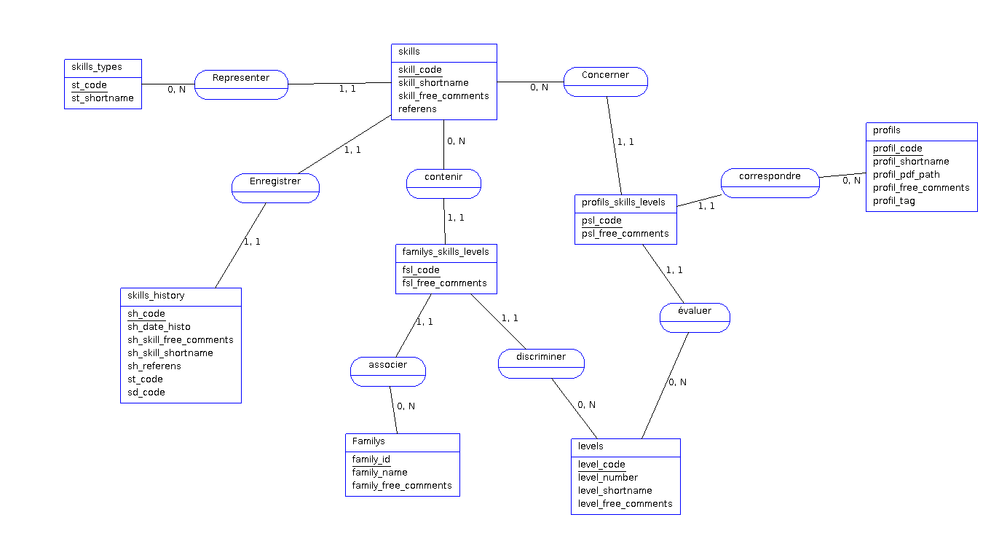
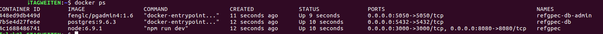
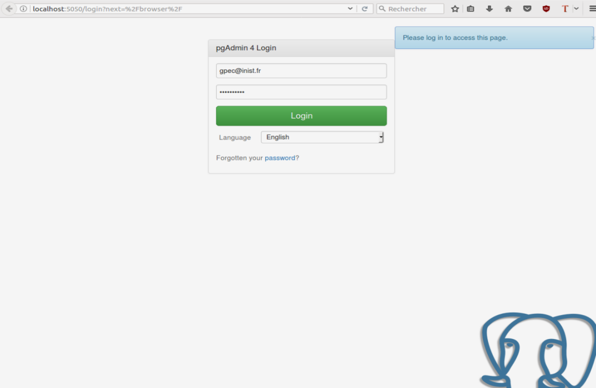
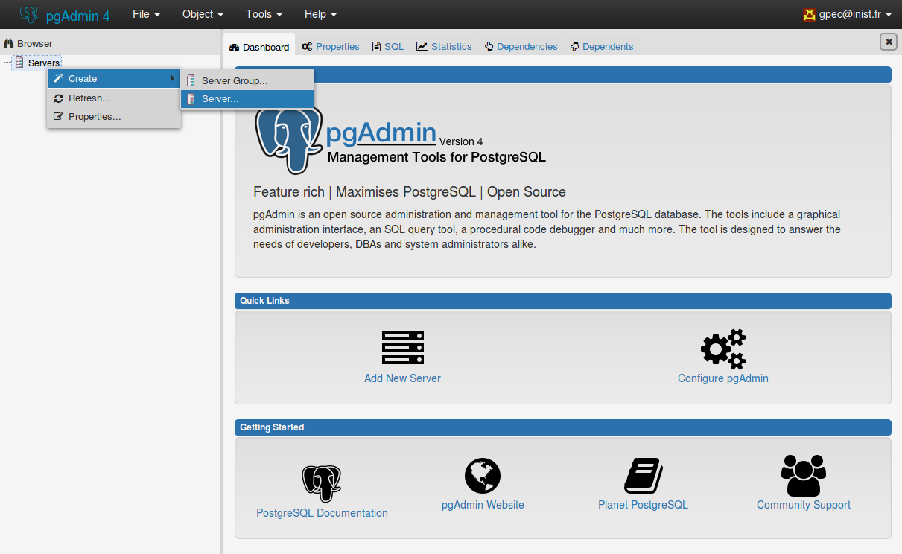
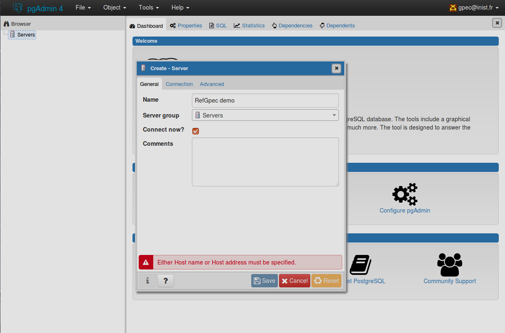
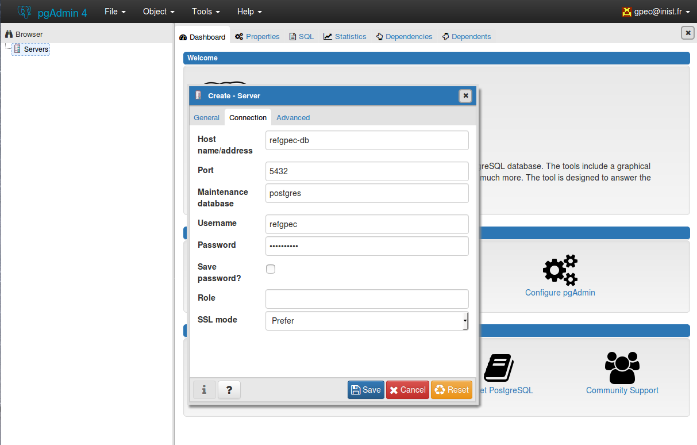
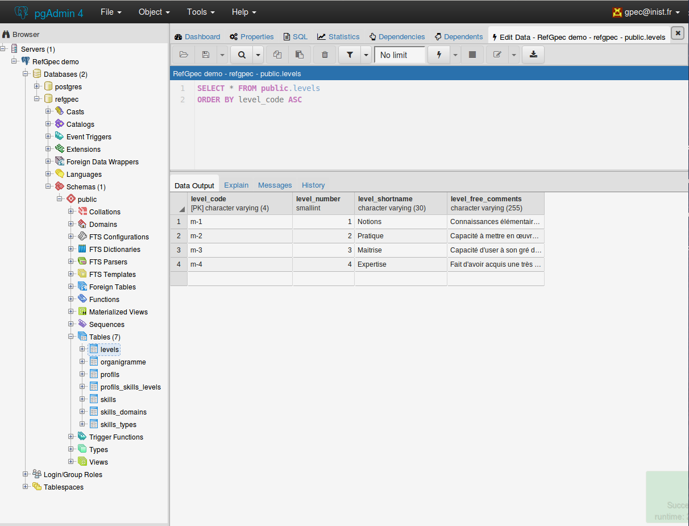
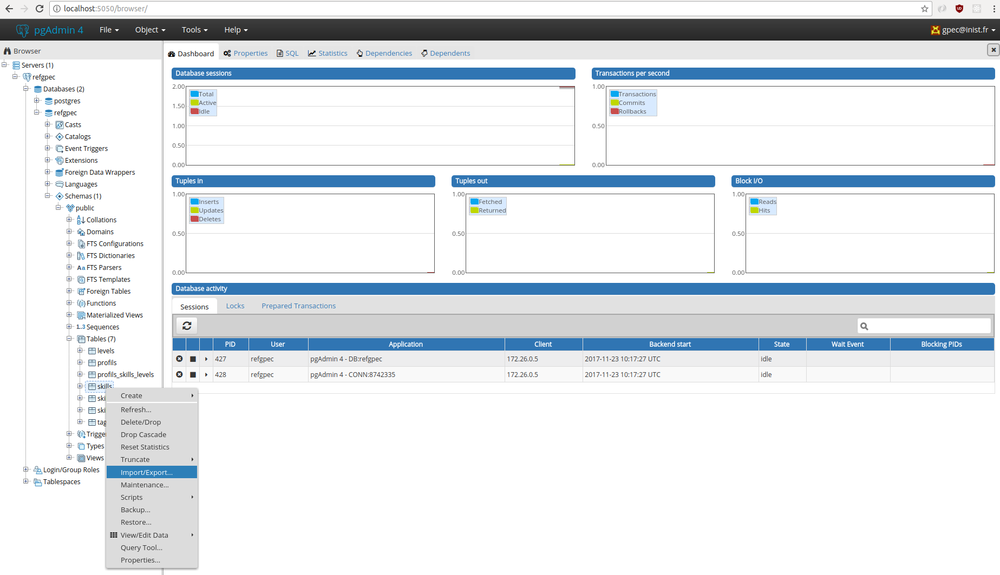
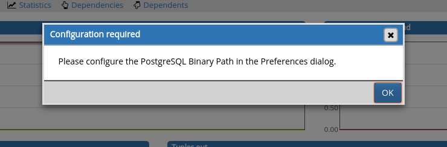
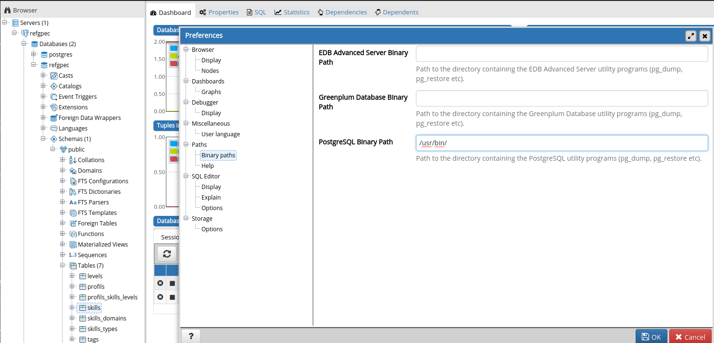

# Developer documentation

## Data conception



[AnalyseSI file](./MCD.asi) used to generate [MCD.png](./MCD.png)

SQL scripts to generate this database are located in the folder [/sql](../sql/) and are executed automaticly at initialisation of container.

The databatase datas are saving in the volume [/data](../data/).

## Configuration Database

#Installation 

Start node, pgadmin and postgresql by running the following commands : 
```sh
make run-debug
```

Check if docker container is running : 

```sh
docker ps 
```
At the moment, you'll have to three running docker (node, postgresql and pgadmin)


# Create connection to the database with pgAdmin

Then navigate to PgAdmin via this adress (by default) : [PgAdmin](http://http://localhost:5050/browser/)

Enter your user name and password in the appropriate fields.(The values are in the file [docker-compose.debug.yml](../docker-compose.debug.yml))

By default : email = gpec@inist.fr and password = gpecsecret 



Now, right-click on the left menu to create a Server :


Then, Enter any name for your new Server


Next, in the connection tab, Fill out the fields with this parameters : 

| Field            | Value By Default | Name in docker-compose.debug.yml |
| ---------------- | ---------------- | -------------------------------- |
| Host name/adress | refgpec-db       | container_name of our postgresql |
| Username         | refgpec          | POSTGRES_USER                    |
| Password         | gpecsecret       | POSTGRES_PASSWORD                |



Now, pgAdmin is connected to our database postgresql located in its container. And we have access to this one.




# Import CSV file into database 

PgAdmin has GUI for data import since 1.16. Once your tables created,  you can import data easily.

1. Just right-click on the table name and click on Import.




```
	⚠ If you have this error message, Following this instructions :
	1. Go to the Preferences Menu in the File tab :
	2. Click on Paths> Binary Paths. And fill out the field "PostGreSQL Binary Path" with the value " /usr/bin/" and validate with OK button.
```




2. Now, choose IMPORT  through the  "Import/Export" button,  you must import your local file into pgadmin and select the correct encodage(usually Utf-8) and delimiter of your CSV. 
  

## Rules and Format required

Following the database's Schema. Many conditions are necessary to respect the importations, in particular through the CSV format  : 
	1. Each file have a header describing each table's columns. These columns must be in the same order as the database's Schema. 
	2. Frequently, the files are saved with the delimiter ";", check this when you're saving or import the data.
	3. Usually the default encodage is UTF-8, keep an eye on special characters and/or symbol

Once this is done, please respect the order of dependancies of SQL's foreign-key. One possible solution is : 
	1. Levels Table
	2. Types Table
	3. Domains Table
	4. Skills Table
	5. Profils Table
	6. Profils_Skills_Levels Table

⚠ To help you, the folder  [/data/examples](../data/examples) contains examples of differents Tables to import.
